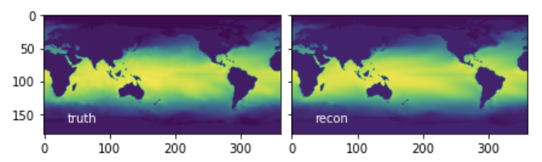
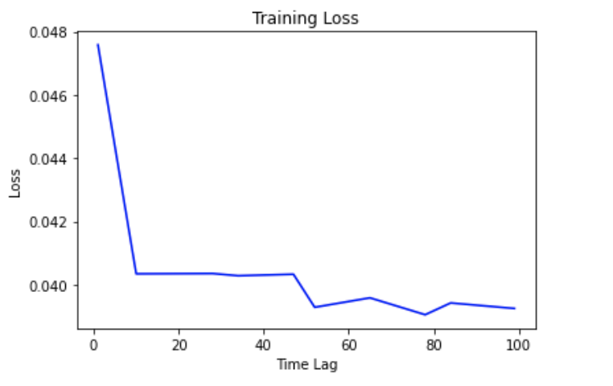
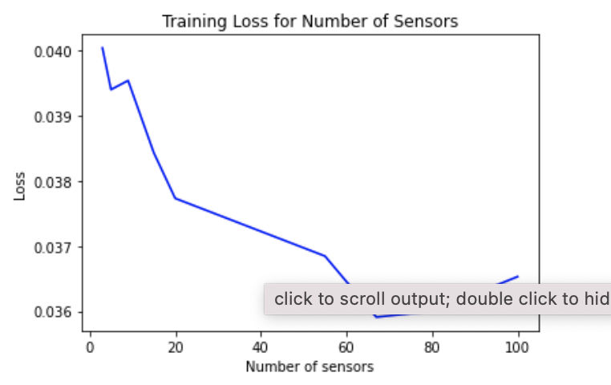
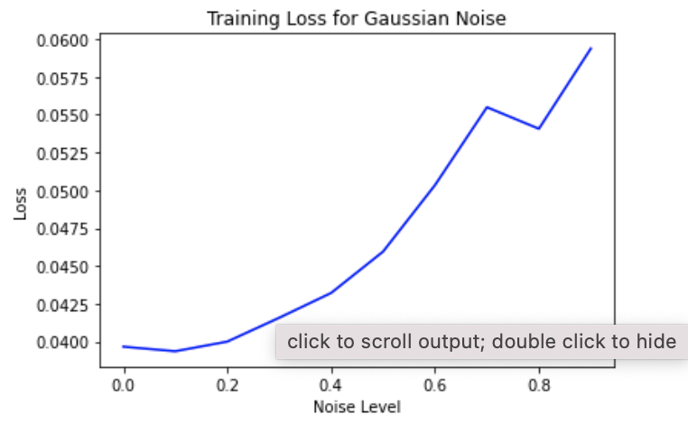

# Sensors and Decoders
Author: Samantha E. Reksosamudra

## Abstract
The goal of this project was to do analysis on the performance of SHallow REcurrent Decoders (SHRED) from a given code found here: https://github.com/shervinsahba/pyshred. We trained the model, plot results and do an analysis of the performance as a function of time lag variable, Gaussian noise, and number of sensors. Time lag and number of sensors variable have a positive relationship with the loss value, while Gaussian noise increases the loss.  

## Sec. I. Introduction and Overview
In practical applications, LSTM networks are used for tasks such as sentiment analysis, speech recognition, handwriting recognition, and predicting future values in time series data. Decoders, on the other hand, are employed to generate human-readable outputs, such as generating coherent sentences in natural language processing tasks or reconstructing images from encoded representations in computer vision tasks.

The code in the given repository (by Jan P. Williams, Olivia Zahn, and J. Nathan Kutz) provides an overview of the SHallow REcurrent Decoders (SHRED) model that "learn a mapping from trajectories of sensor measurements to a high-dimensional, spatio-temporal state." And the dataset used to train and test this model includes sea-surface temperature (SST), a forced turbulent flow, and atmospheric ozone concentration.

This project consists of: (1) an example usage found in ```example.ipynb```, (2) define the values to train the model on based on the variable we're testing (i.e. time lag, Gaussian noise, number of sensors), (3) train the network using the SHRED algorithm, (4) evaluate the performance on a test set and generate the loss values, and (5) repeat for other variables to test. Additionally, we can adjust the parameters, such as learning rate, epoch size, and batch size, by hyperparameter tuning.

## Sec. II. Theoretical Background
Long Short-Term Memory (LSTM) is a type of recurrent neural network (RNN) architecture that is designed to process and learn from sequential data. It is particularly effective in handling long-term dependencies and capturing patterns over time. LSTMs use a memory cell and various gates (input, forget, and output) to control the flow of information and update the memory cell state. They are widely used in applications such as natural language processing (NLP), speech recognition, time series analysis, and machine translation.

In the context of machine learning, decoders refer to a component or a network architecture responsible for generating output from learned representations or features. They take encoded or hidden representations from an encoder network (which captures relevant information from input data) and transform them into the desired output format. Decoders are commonly used in tasks such as language generation, image captioning, machine translation, and text-to-speech synthesis.


## Sec. III Algorithm Implementation 
  ### Train Model
  Based on the example code, we prepared the input data and trained the model using the SST dataset.
  ```
  import numpy as np
from processdata import load_data, TimeSeriesDataset
import models
import torch
import matplotlib.pyplot as plt
from sklearn.preprocessing import MinMaxScaler

# Randomly select 3 sensor locations 
num_sensors = 3 

# Set the trajectory length (lags) to 52, corresponding to one year of measurements.
lags = 52
 
# Load the data
load_X = load_data('SST')
n = load_X.shape[0]
m = load_X.shape[1]
sensor_locations = np.random.choice(m, size=num_sensors, replace=False)

train_indices = np.random.choice(n - lags, size=1000, replace=False)
mask = np.ones(n - lags)
mask[train_indices] = 0
valid_test_indices = np.arange(0, n - lags)[np.where(mask!=0)[0]]
valid_indices = valid_test_indices[::2]
test_indices = valid_test_indices[1::2]

sc = MinMaxScaler()
sc = sc.fit(load_X[train_indices])
transformed_X = sc.transform(load_X)

### Generate input sequences to a SHRED model
all_data_in = np.zeros((n - lags, lags, num_sensors))
for i in range(len(all_data_in)):
    all_data_in[i] = transformed_X[i:i+lags, sensor_locations]

### Generate training validation and test datasets both for reconstruction of states and forecasting sensors
device = 'cuda' if torch.cuda.is_available() else 'cpu'

train_data_in = torch.tensor(all_data_in[train_indices], dtype=torch.float32).to(device)
valid_data_in = torch.tensor(all_data_in[valid_indices], dtype=torch.float32).to(device)
test_data_in = torch.tensor(all_data_in[test_indices], dtype=torch.float32).to(device)

### -1 to have output be at the same time as final sensor measurements
train_data_out = torch.tensor(transformed_X[train_indices + lags - 1], dtype=torch.float32).to(device)
valid_data_out = torch.tensor(transformed_X[valid_indices + lags - 1], dtype=torch.float32).to(device)
test_data_out = torch.tensor(transformed_X[test_indices + lags - 1], dtype=torch.float32).to(device)

train_dataset = TimeSeriesDataset(train_data_in, train_data_out)
valid_dataset = TimeSeriesDataset(valid_data_in, valid_data_out)
test_dataset = TimeSeriesDataset(test_data_in, test_data_out)

### Train the network
shred = models.SHRED(num_sensors, m, hidden_size=64, hidden_layers=2, l1=350, l2=400, dropout=0.1).to(device)
validation_errors = models.fit(shred, train_dataset, valid_dataset, batch_size=64, num_epochs=30, lr=1e-3, verbose=True, patience=5)
  ```
  
  ### Test Model
  Then we calculated the loss value of this model which prints a value of 0.039674558.
  
  ```
  test_recons = sc.inverse_transform(shred(test_dataset.X).detach().cpu().numpy())
test_ground_truth = sc.inverse_transform(test_dataset.Y.detach().cpu().numpy())
print(np.linalg.norm(test_recons - test_ground_truth) / np.linalg.norm(test_ground_truth))
  ```
  
  ### Plot Results
  ```
  from processdata import load_full_SST

# SST data with world map indices for plotting
full_SST, sst_locs = load_full_SST()
full_test_truth = full_SST[test_indices, :]

# replacing SST data with our reconstruction
full_test_recon = full_test_truth.copy()
full_test_recon[:,sst_locs] = test_recons

# reshaping to 2d frames
for x in [full_test_truth, full_test_recon]:
    x.resize(len(x),180,360)
    
    plotdata = [full_test_truth, full_test_recon]
labels = ['truth','recon']
fig, ax = plt.subplots(1,2,constrained_layout=True,sharey=True)
for axis,p,label in zip(ax, plotdata, labels):
    axis.imshow(p[0])
    axis.set_aspect('equal')
    axis.text(0.1,0.1,label,color='w',transform=axis.transAxes)
  ```
  The code above resulted in a plot that shows the true and reconstructed image. 
  
  
 ### Data Preparation for a Performance Analysis
 Firstly, we define the values of the variable we want to test.
 
 ```
 # Define time lag values to test
time_lag_values = [1, 10, 28, 34, 47, 52, 65, 78, 84, 99]

# Define variables of number of sensors to test
num_sensors = [3, 5, 9, 15, 20, 55, 67, 80, 100]

# Define the parameters for Gaussian noise
noise_levels = [0, 0.1, 0.2, 0.3, 0.4, 0.5, 0.6, 0.7, 0.8, 0.9]  # Specify the range of noise (standard deviation) levels 
mean = 0  # Mean of the Gaussian noise
 ```
 
 The following is an example of the data preparation step for a performance analysis on SHRED as a function of time lag:
 ```
 results = []
test_recon_vals = []

for lags in time_lag_values:

    start_time = time.time()
        
    # Prepare SHRED dataset
    train_indices = np.random.choice(n - lags, size=1000, replace=False)
    mask = np.ones(n - lags)
    mask[train_indices] = 0
    valid_test_indices = np.arange(0, n - lags)[np.where(mask!=0)[0]]
    valid_indices = valid_test_indices[::2]
    test_indices = valid_test_indices[1::2]
        
    ### Generate input sequences to a SHRED model
    all_data_in = np.zeros((n - lags, lags, num_sensors))
    for i in range(len(all_data_in)):
        all_data_in[i] = transformed_X[i:i+lags, sensor_locations]

    ### Generate training validation and test datasets both for reconstruction of states and forecasting sensors
    device = 'cuda' if torch.cuda.is_available() else 'cpu'

    train_data_in = torch.tensor(all_data_in[train_indices], dtype=torch.float32).to(device)
    valid_data_in = torch.tensor(all_data_in[valid_indices], dtype=torch.float32).to(device)
    test_data_in = torch.tensor(all_data_in[test_indices], dtype=torch.float32).to(device)

    ### -1 to have output be at the same time as final sensor measurements
    train_data_out = torch.tensor(transformed_X[train_indices + lags - 1], dtype=torch.float32).to(device)
    valid_data_out = torch.tensor(transformed_X[valid_indices + lags - 1], dtype=torch.float32).to(device)
    test_data_out = torch.tensor(transformed_X[test_indices + lags - 1], dtype=torch.float32).to(device)

    train_dataset = TimeSeriesDataset(train_data_in, train_data_out)
    valid_dataset = TimeSeriesDataset(valid_data_in, valid_data_out)
    test_dataset = TimeSeriesDataset(test_data_in, test_data_out)
        
    # Train SHRED on dataset
    shred = models.SHRED(num_sensors, m, hidden_size=64, hidden_layers=2, l1=350, l2=400, dropout=0.1).to(device)
    validation_errors = models.fit(shred, train_dataset, valid_dataset, batch_size=64, num_epochs=30, lr=1e-3, verbose=True, patience=5)
        
    # Calculate elapsed time
    elapsed_time = time.time() - start_time
        
    # Calculate the loss
    test_recons = sc.inverse_transform(shred(test_dataset.X).detach().cpu().numpy())
    test_ground_truth = sc.inverse_transform(test_dataset.Y.detach().cpu().numpy())
    percent_error = np.linalg.norm(test_recons - test_ground_truth) / np.linalg.norm(test_ground_truth)
        
    # Store the results
    results.append((lags, percent_error, elapsed_time))
    
    # Store reconstructed test values
    test_recon_vals.append(test_recons)
 ```
  We store the information we want (i.e. time lag tested value, loss value, and elapsed time for the training) to an empty list. And we will see the results when we print them in the next step. 
  
  ### Print The Results
  ```
  # Print the results
  for result in results:
    lags, percent_error, elapsed_time = result
    print(f"Time Lag: {lags}, Loss: {percent_error}, Elapsed Time: {elapsed_time}")
  ```
## Sec. IV. Computational Results
  ### SHRED Performance As A Function of Time Lag
  Below is the resulted loss values for the respective time lag value. Initially, the example code used ```lags=52```.
  ```
Time Lag: 1, Loss: 0.0475803017616272, Elapsed Time: 64.11505222320557
Time Lag: 10, Loss: 0.04034581035375595, Elapsed Time: 62.974735736846924
Time Lag: 28, Loss: 0.04035485163331032, Elapsed Time: 64.7619400024414
Time Lag: 34, Loss: 0.04028468206524849, Elapsed Time: 63.97046995162964
Time Lag: 47, Loss: 0.040331803262233734, Elapsed Time: 67.04755806922913
Time Lag: 52, Loss: 0.039287783205509186, Elapsed Time: 70.53368306159973
Time Lag: 65, Loss: 0.03958641737699509, Elapsed Time: 71.29558181762695
Time Lag: 78, Loss: 0.03905293717980385, Elapsed Time: 73.6594910621643
Time Lag: 84, Loss: 0.039425019174814224, Elapsed Time: 71.60625791549683
Time Lag: 99, Loss: 0.03925091773271561, Elapsed Time: 75.26624894142151
  ```
  The plot below shows a negative relationship between time lag and loss. As time lag value increased, the loss decreased.
  
  
  ### SHRED Performance As A Function of Number of Sensors
  Below is the resulted loss values for the respective number of sensors used. Initially, the example code used ```num_sensors=3```.
  ```
Number of Sensors: 3, Loss: 0.04003076255321503
Number of Sensors: 5, Loss: 0.0393928587436676
Number of Sensors: 9, Loss: 0.03953132778406143
Number of Sensors: 15, Loss: 0.038426756858825684
Number of Sensors: 20, Loss: 0.037728726863861084
Number of Sensors: 55, Loss: 0.036844830960035324
Number of Sensors: 67, Loss: 0.035911086946725845
Number of Sensors: 80, Loss: 0.0360005684196949
Number of Sensors: 100, Loss: 0.036530159413814545
  ```
  The plot below shows a negative relationship between time lag and loss. As the number of sensors increased, the loss decreased.
  
  
  ### SHRED Performance As A Function of Gaussian Noise
  For Gaussian noise, there are two parameters: mean and standard deviation.  We set the ```mean=0``` and varied the standard deviation because it can assess the model's robustness to different levels of noise intensity. This approach allows you to observe how the model performs under different noise magnitudes, ranging from low to high. It helps evaluate the model's generalization and stability across a wide range of noise levels.
  
  Below is the resulted loss values for the respective noise level used. 
  ```
Noise Level: 0, Loss: 0.03966614976525307
Noise Level: 0.1, Loss: 0.039365384727716446
Noise Level: 0.2, Loss: 0.04000096395611763
Noise Level: 0.3, Loss: 0.041575949639081955
Noise Level: 0.4, Loss: 0.043216098099946976
Noise Level: 0.5, Loss: 0.045950569212436676
Noise Level: 0.6, Loss: 0.050347115844488144
Noise Level: 0.7, Loss: 0.055492185056209564
Noise Level: 0.8, Loss: 0.05406790226697922
Noise Level: 0.9, Loss: 0.05937511846423149
  ```
  The plot below shows a positive relationship between noise and loss. As the noise increased, the loss also increased.
  
  
## Sec. V. Summary and Conclusions
The performance of SHRED gave better predictions as we incrased lags and number of sensors in the model, and adding noise to the data instead increased the loss values (as expected). By tuning the parameters more, we could explore more on how to optimize SHRED. But this project was a good practice to train LSTMs, decoders, and sensors, and explore its performances as function of some variables. 

