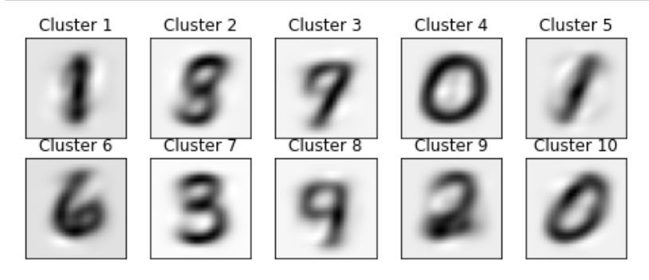
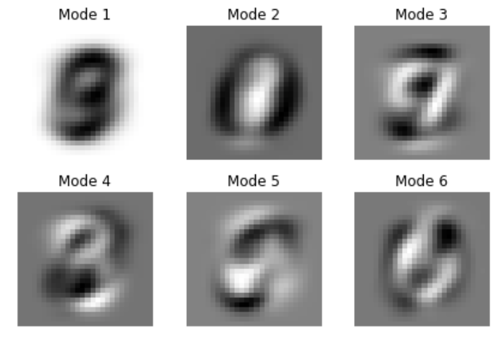
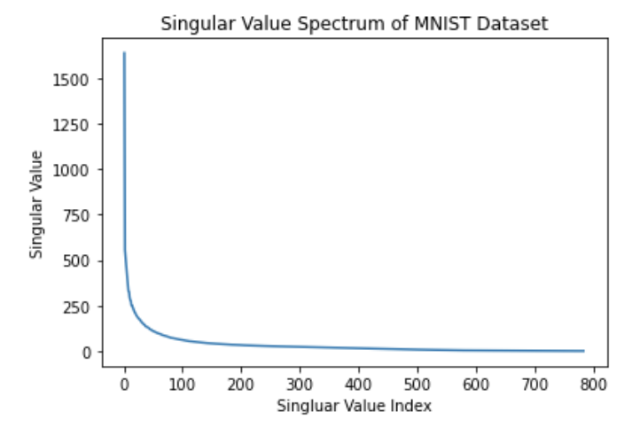
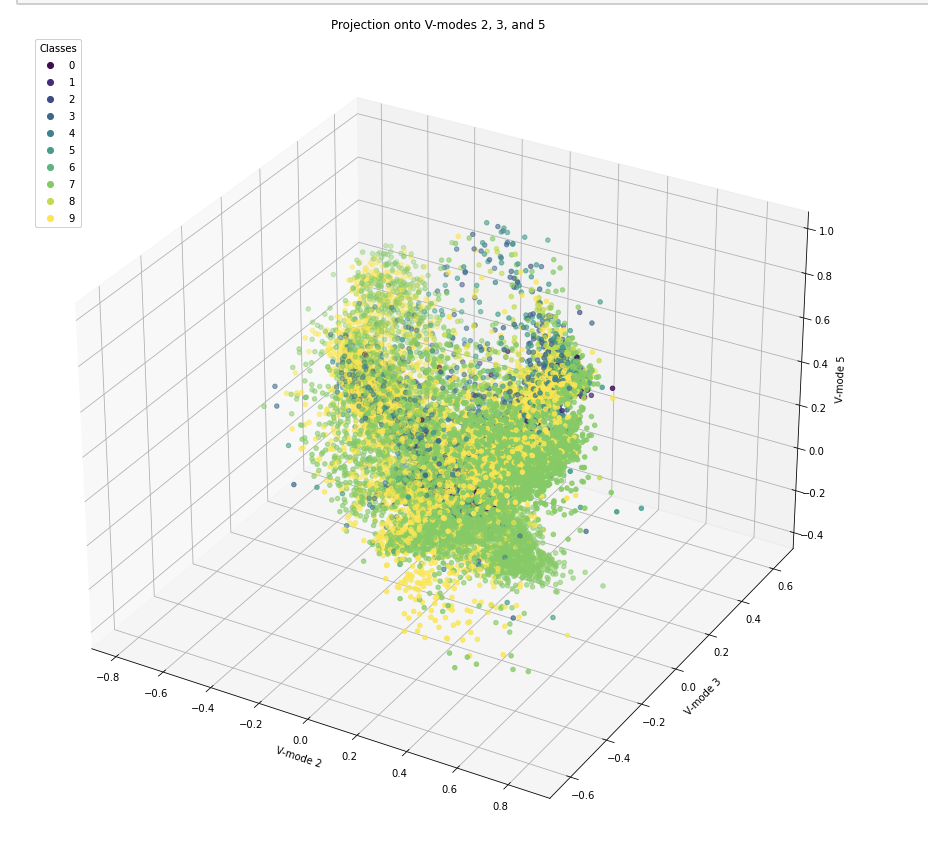
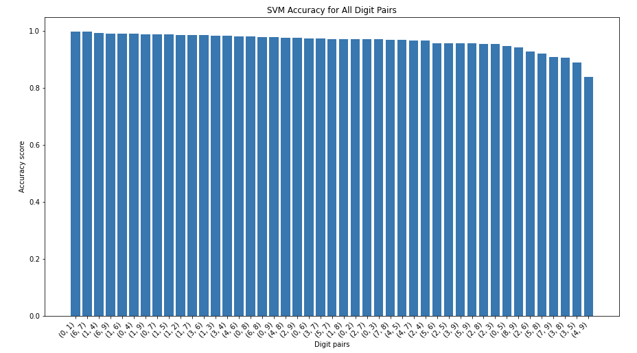

# MNIST and Classifiers
Author: Samantha E. Reksosamudra

## Abstract
The goal of this project was to do analysis on the MNIST dataset using SVD and a couple of classifier methods, including Linear Discriminant Analysis (LDA), Support Vector Machine (SVM), and Decision Tree Classifiers. There were around 100 modes or feature spaces that are dominant when classifying each digit. Then, the dataset was split into training and test sets, and they were trained and tested using different classifier methods. Although SVM analysis took significantly more time, it has the highest accuracy score of 83.8%. Using SVM, it is also found that the hardest digit pairs to separate were 4 and 9 with an accuracy of 83.8%. Meanwhile, the easiest digit pairs to separate was 0 and 1 with an accuracy of 100%. 
 
## Sec. I. Introduction and Overview
This project explores how to apply SVD to the MNIST dataset, and train the dataset using classifier methods to separate each data based on their label. Then, the model is tested to some dataset (not used in the training) and see the accuracy score of the classifiers' prediction. Using SVD analysis, we can see the number of feature spaces that are dominant to classify the dataset. While the classifier methods (i.e. LDA, SVM, Decision Tree Classifiers) are the tools to train and test the dataset. 

## Sec. II. Theoretical Background
The MNIST dataset is a large database containing 70,000 images (28 x 28) of handwritten digits from 0 to 9. It is often used for traning and testing in image processing and machine learning. Based on each image's labels, we can train and classify each image to predict the a given image's label (or also called as cluster). 

Using KMeans (another clustering method), these are the clusters for each digits in the MNIST dataset, where each cluster represents a digit. 



If we are separating only two digits, then a linear classifier (LDA) could be an effective method to classify the training data. While SVM and Decision Tree Classifiers are some popular methods (until 2014) to classify and separate the dataset based on their labels. 

## Sec. III Algorithm Implementation
  ### SVD Analysis
  Firstly, we load the dataset using ```fetch_openml``` and convert them to numpy arrays. We also change the datatype to floats and integers for later analysis. Then we reshape the matrix so that the images are on the column of the matrix (so each column represents a different image):
  
  ```
# Load the MNIST dataset from OpenML
mnist = fetch_openml('mnist_784')

# Convert the data and labels to numpy arrays
X = mnist.data.astype('float32') / 255.0    
y = mnist.target.astype('int32')

# Reshape the images into column vectors
X_t = X.T
  ```
  Then we put the matrix X into SVD using ```np.linalg.svd``` and plot the Singular Value Spectrum (the S matrix returned from SVD) to see the modes or feature spaces that matter the most:
  ```
  # Perform SVD on X
  U, S, Vt = np.linalg.svd(X_t, full_matrices=False)
  ```
  The S matrix contains the eigenvalues of the MNIST dataset (given as matrix X here) and is sorted in a descending order based on the amount of variation in the data. While the U and Vt matrix are orthogonal matrices and contains eigenvectors, where the vectors span the column space and row space of the original matrix respectively. 
  
  We can also plot to see the six the most dominant feature spaces in the MNIST dataset using the code below: 
  
  ```
  # Plot the six SVD modes from MNIST
  fig, axs = plt.subplots(2, 3)
  for i in range(6):
      ax = axs[i // 3, i % 3]
      ax.imshow(U[:, i].reshape(28, 28), cmap='gray')
      ax.axis('off')
      ax.set_title('Mode {}'.format(i+1))
  plt.tight_layout()
  plt.show()
  ```
    
  Each column of the Vt matrix represents a pattern or a feature that is common across the columns of the original matrix. And the importance of each feature is determined by the singular values in the S matrix.  Larger singular values corresponds to higher variance, which means the feature is more important in capturing the structure of the data.
  
  By projecting the data to some three selected V-modes, we can see how the selected modes capture the most important features in the data. Below, we selected column 2, 3, and 5 and used ```np.dot``` to project the dataset onto the V-modes. 
  
  ```
  # Get the three selected V-modes (columns) colored by their digit label
  Vt_modes = Vt[:, [2,3,5]]

  # Project the data onto the modes
  projected_data = np.dot(X_t.T, Vt_modes)
  ```
  ### LDA Classifier for Two Digits
  Firstly, the dataset was projected onto a PCA space to reduce the dimensionality of the data. I chose to classify between digit 0 and 1, so I extract the images with the respective labels, and split the data into training and testing sets:
  
  ```
  # Perform PCA to reduce the dimensionality of the data
  pca = PCA(n_components=10)
  X_pca_train = pca.fit_transform(X)

  # Extract the data for 0 and 1 digits
  label_0 = 0
  label_1 = 1

  X_0 = X_pca_train[y == label_0]  
  X_1 = X_pca_train[y == label_1]
  y_0 = y[y == 0] 
  y_1 = y[y == 1]

  # Split the digit-0 dataset into training and testing sets
  X_train_0, X_test_0, y_train_0, y_test_0 = train_test_split(X_0, y_0, test_size=0.2, random_state=42)

  # Split the digit-1 dataset into training and testing sets
  X_train_1, X_test_1, y_train_1, y_test_1 = train_test_split(X_1, y_1, test_size=0.2, random_state=42)

  # Stack the data and labels of digit 0 and 1 into one array
  X_train = np.vstack([X_train_0, X_train_1])
  y_train = np.hstack([y_train_0, y_train_1])
  ```
  
  The training data was given to the LDA classifier method to train the model. Then we tested the model on the remaining test data and see how well it predicted the images in the test data based on the accuracy score:
  
  ```
  # Train a LDA classifier on the PCA-transformed data
  clf = LinearDiscriminantAnalysis()
  clf.fit(X_train, y_train)

  # Make predictions on the test examples
  y_pred_0 = clf.predict(X_test_0)
  y_pred_1 = clf.predict(X_test_1)

  # Compute the accuracy of the classifier on the test set
  acc_0 = np.mean(y_pred_0 == 0)
  acc_1 = np.mean(y_pred_1 == 1)
  acc = (acc_0 + acc_1) / 2

  print(f"Accuracy on digit {label_0}: {acc_0:.3f}")
  print(f"Accuracy on digit {label_1}: {acc_1:.3f}")
  print(f"Overall accuracy: {acc:.3f}")
  ```
  
  The same process can be done to classify between three digits. This can be done by adding the data and label of the third digit that is extracted from the original dataset. 
 
 ### Finding the Hardest and Easiest Digit Pairs to Separate
 Using a for loop, we will go through every digit pairs from 0 to 9 and compute the accuracy score for each digit pairs. The hardest digit pairs to separate is the one with the lowest accuracy score, while the easiest to separate is the one with the highest accuracy score. 
 
 ```
 # Create an empty dictionary for accuracy scores of each digit pairs
 accuracy_scores_lda = {}
 
 # Create a list of combinations of all digit pairs from 0 to 9
 digit_pairs = list(combinations(range(10), 2))
 
 # Train a binary classifier for each pair of digit
 for pair in digit_pairs:
     X_pair = X_pca_train[(y == (pair[0])) | (y == (pair[1]))]
     y_pair = y[(y == (pair[0])) | (y == (pair[1]))]

     # Split the whole dataset into training and testing sets
     X_train, X_test, y_train, y_test = train_test_split(X_pair, y_pair, test_size=0.2, random_state=42)

     clf = LinearDiscriminantAnalysis()
     clf.fit(X_train, y_train)
     y_pair_pred = clf.predict(X_test)
     accuracy = accuracy_score(y_test, y_pair_pred)
     accuracy_scores_lda[pair] = accuracy

 # Print the hardest and easiest pairs of digits to separate
 hardest_pair = min(accuracy_scores, key=accuracy_scores_lda.get)
 easiest_pair = max(accuracy_scores, key=accuracy_scores_lda.get)
 print('Hardest pair:', hardest_pair, 'Accuracy:', accuracy_scores_lda[hardest_pair])
 print('Easiest pair:', easiest_pair, 'Accuracy:', accuracy_scores_lda[easiest_pair])
 ```
 ### Accuracy Comparison Between SVM, LDA, and Decision Tree Classifiers
 
 Below are some codes to train an SVM, LDA, and Decision Tree Classifiers to the training data. After training the data, then we tested them on the test data and compute the accuracy for each classifier method to compare which method is better to classify the digits in the MNIST dataset.
 
 Train using SVM:
 ```
 # Train an SVM classifier on the training set
 clf = svm.SVC(kernel='linear', C=1)
 clf.fit(X_train, y_train)
 ```
 
 Train using LDA:
 
 ```
 # Train a LDA classifier on the PCA-transformed data
 clf = LinearDiscriminantAnalysis()
 clf.fit(X_train, y_train)
 ```
 
 Train using Decision Tree Classifier:
 
 ```
 # Train a decision tree classifier on the training set
 clf = DecisionTreeClassifier(max_depth=10)
 clf.fit(X_train, y_train)
 ```
  
## Sec. IV. Computational Results
  ### Six SVD Modes of the MNIST Dataset
  
  Based on a previous project, I found the six modes of the MNIST dataset that has the most importance in determining the digit labels. The images below show the most important features in the MNIST dataset.
  
  
  
  
  ### Singular Value Spectrum Plot
  
  Below is the singular value spectrum (the matrix S from the SVD analysis) plot. This graph tells us how large the variation of each feature plays in the structure of the data. The variation decreases exponentially as the index increases. Here, we can see that about 100 modes have significant variation. So around 100 modes are necessary for good image reconstruction.
  
  
 
 This relates to the rank r in digit space which we will use when performing PCA onto the MNIST dataset. So analysis on the MNIST dataset in 100-D (dimension) would give a relatively good image reconstruction and better accuracy scores to predict the digit images.
 
 ### Projection on the V-modes
 After projecting the dataset onto the selected V-modes (e.g. 2,3, and 5), we plotted the datapoints colored by their digit labels as shown below. 
 
 
 
 From the plot, we can see how each images of digits cluster based on the V-modes.
 
 ### Accuracy Score of LDA with Two and Three Digits
 When training the data for digit 0 and 1 using LDA, we found an overal accuracy of 99.6%. The accuracy score is pretty high due to the significant difference between 0 and 1 (i.e. it's easy to differentiate between 0 and 1 because 0 is like a circle, while 1 is like a line).
 
 ```
 Accuracy on digit 0: 0.993
 Accuracy on digit 1: 1.000
 Overall accuracy: 0.996
 
 ```
 
 When training the data for three digits, the overall accuracy score decreased. In this case, I chose digit 0, 1 and 3. Since LDA classifies the data using a line, there may be some datapoints which are not perfectly classified to their respective actual labels. But overall, the accuracy score is still good with a score of 95.4%.
 
 ```
 Accuracy on digit 0: 0.937
 Accuracy on digit 1: 0.992
 Accuracy on digit 3: 0.931
 Overall accuracy: 0.954
 ```
 
 ### Comparison Between SVM, LDA, and Decision Tree Classifiers
 After using a classifier method on the training dataset and predict the test datasets for all the digits, the accuracy score was computed for SVM, LDA, and Decision Tree Classifiers. It is found that SVM, LDA, and Decision Tree Classifiers have an accuracy score of 83.8%, 79.5%, and 77.0% respectively. Although it took the longest time to compute, the most accurate classifier method is SVM.
 
 ### Hardest and Easiest Pair of Digits to Separate
 The following shows the hardest pair and easiest pair of digits to separate alongside their accuracy score for each classifier method. 
 
 ```
 # SVM method
 Hardest pair: (4, 9) Accuracy: 0.8382299601015597
 Easiest pair: (0, 1) Accuracy: 0.9989851150202977

 # LDA method
 Hardest pair: (4, 9) Accuracy: 0.8375045339136743
 Easiest pair: (0, 1) Accuracy: 0.9969553450608931
 
 # Decision Tree Classifier method
 Hardest pair: (4, 9) Accuracy: 0.863619876677548
 Easiest pair: (0, 1) Accuracy: 0.9959404600811907
 ```
The results were consistent with 4 and 9 being the hardest pair of digits to separate and 0 and 1 being the easiest pair of digits to separate. Althought the accuracy scores are similar, the SVM method shows a slightly better accuracy score with 83.8% for the hardest pair and 99.9 for the easiest pair. 

On the bar graph plot below, we can see the sorted accuracy score for all digit pairs. 



## Sec. V. Summary and Conclusions
The SVD analysis is an effective method to find the most important features that structures a dataset. We found there are about 100 modes that are significantly important in the MNIST dataset. And we also tried different classifier methods on the dataset, where we found SVM to be the best predictor with the highest accuracy score compared with LDA and Decision Tree Classifiers. It is also interesting to see the digit pairs that are the hardest (4 and 9) and easiest (0 and 1) to separate in the dataset using classifier methods. 


