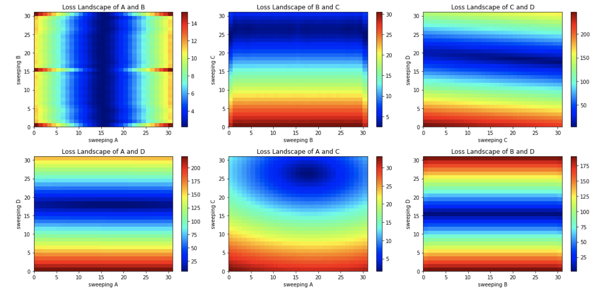

# SVD and Yale Faces
Author: Samantha E. Reksosamudra

### Abstract
The goal of this project was to use SVD and apply it to the Yale Faces data (attached in this branch as yalefaces.mat) to find the 

### Sec. I. Introduction and Overview


### Sec. II. Theoretical Background


### Sec. III Algorithm Implementation
  ### Computed Minimum Error and Parameter Values
  Using the least-squares error function, the computed minimum error and parameter values are given as below.
  ```
  Minimum error:  1.592725853040056
A:  2.1716818723637914
B:  0.9093249029166655
C:  0.7324784894461773
D:  31.45291849616531
  ```
  ### 2D Loss Landscape of Parameter Pairs
  Before we start training data models, the least-squares error function was used to generate a 2D loss (error) landscape by fixing two parameters and sweeping across the other parameters. Using pcolor, we visualized the loss landscapes in a grid as we sweep through values of different combinations of parameter pairs. This visualization helped to see the local minima of errors as we fix and sweep through different combinations of parameter pairs. 




### Sec. IV. Computational Results
 

### Sec. V. Summary and Conclusions


