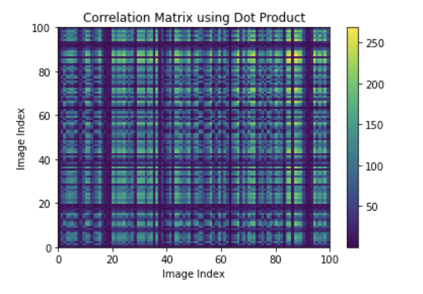
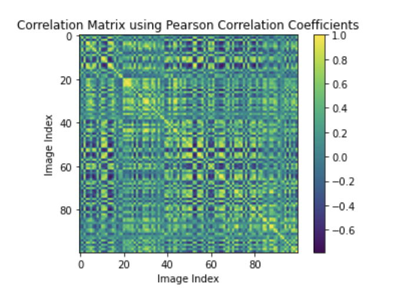
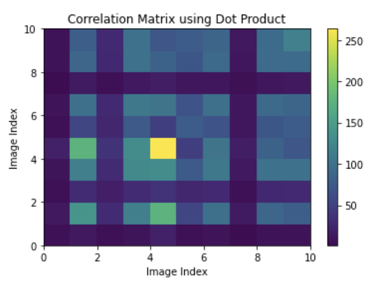
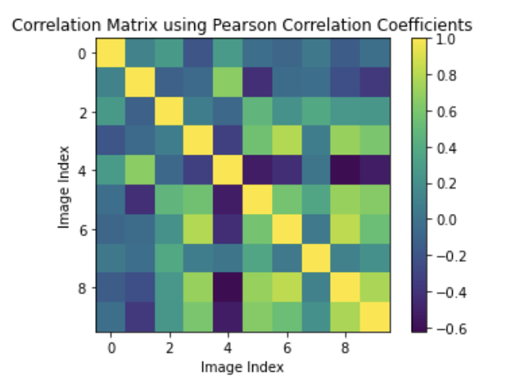
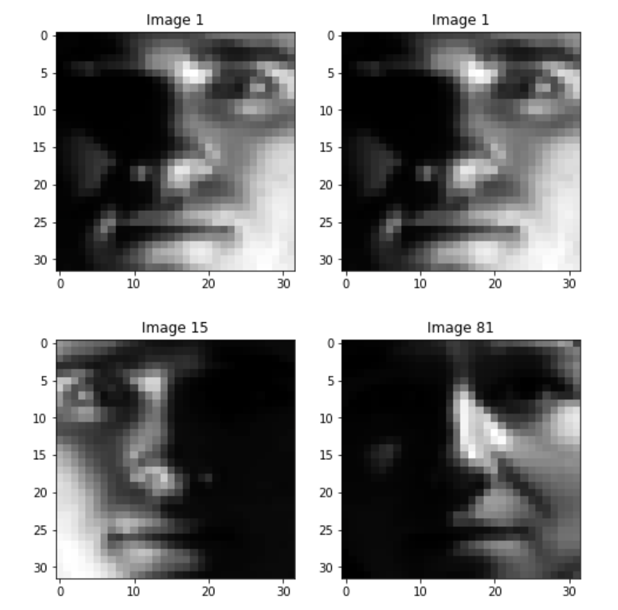

# SVD and Yale Faces
Author: Samantha E. Reksosamudra

### Abstract
The goal of this project was to use SVD and apply it to the Yale Faces database (attached in this branch as yalefaces.mat) to find the correlation between each faces and the six most dominant feature spaces. By taking a sample of faces and computing the correlation matrix, it is found that the strongest correlation lies in the faces that are diagonal with each other. To find the six most dominant feature spaces, we can use the dot product and compute the eigenvectors or use SVD and extract the eigenvectors. The absolute value of norm of difference of the first eigenvector from the first and second method 
are calculated to be 2.0. It is also found that the percentage of variance captured by the six SVD modes ranged from 1.5% to 16.6%.

### Sec. I. Introduction and Overview
This project explores how to apply SVD to the Yale Faces database and find the most dominant feature spaces by extracting the eigenvectors of the orthogonal matrices. We will compare the SVD method with the manual eigenvectors method, and compute the norm of difference and the percentage of variance of the SVD modes. This project also explores the correlation matrix application and  how each faces correlate with each other.

### Sec. II. Theoretical Background
The Yale Faces data has a total of 39 different faces with about 65 lighting scenes for each face, so it is 2414 faces in total. The individual images are columns of the matrix X, where each image has been downsampled to 32 × 32 pixels and converted into gray scale with values between 0 and 1. So the matrix's  size 1024 × 2414. 

Singular Value Decomposition (SVD) is a matrix factorization technique that decomposes a matrix into three matrices. It is used in various fields such as image processing, signal processing, and machine learning. Given a matrix X, SVD decomposes the matrix into the form X = USVt, where U and V are orthogonal matrices, and S is a diagonal matrix with non-negative values on the diagonal. The eigenvectors inside the orthogonal matrices are the principal component directions, which are also used in this project as the most dominant feature spaces of the faces. We can also compute the eigenvectors of the matrix X and extract the top eigenvectors to find the the principal component directions. 

On the other hand, we can find the correlation matrix by taking the dot product of the sample data or use the Pearson correlation coefficient formula. The Pearson correlation is one of the most common way of measuring a linear correlation. It ranges from -1 to 1 and measures the strength and direction of the relationship between two variables. 


### Sec. III Algorithm Implementation
  ### Compute The Correlation Matrix
  Firstly, we extract 100 samples of faces, then compute the correlation matrix using ```np.matmul```:
  
  ```
# Get the first 100 images of yalefaces
X_sample = X[:, 1:101]                      

# Compute the dot (matrix) product of two arrays, resulting in the correlation matrix
C_100 = np.matmul(X_sample.T,X_sample)

# Print the correlation matrix
print(C_100)
  ```
  
  The resulting matrix was then plotted using ```plt.pcolor```.
  
  ```
  # Plot the correlation matrix
  plt.pcolor(C_100)
  plt.colorbar()
  plt.title('Correlation Matrix using Dot Product')
  plt.xlabel('Image Index')
  plt.ylabel('Image Index')
  ```
  
  
  However, the resulting dot product has values ranging from 0 to around 250. It is easier to see the correlation between each image using the Pearson correlation coefficient, called in the numpy module as ```np.corrcoef```, which resulted in values ranging from around -0.6 to 1.0. 
  
  ```
  # Compute the correlation matrix using Pearson product-moment correlation coefficients
  correlation_matrix = np.corrcoef(X_sample.T)
  print(correlation_matrix)
  
  # Plot the correlation matrix
  plt.imshow(correlation_matrix)
  plt.colorbar()
  plt.title('Correlation Matrix using Pearson Correlation Coefficients')
  plt.xlabel('Image Index')
  plt.ylabel('Image Index')
  ```
  
  ### Finding the Most Correlated and Uncorrelated Images
  Using ```np.argmax``` and ```np.argmin``, we find the flattened indexes where the correlation values are the highest/lowest. Then ```np.unravel_index``` was used to return a tuple of indices that can be used to index into the 2D matrix.
  
  ```
# Find the indices of the maximum and minimum correlation coefficients
max_idx = np.unravel_index(np.argmax(correlation_matrix), correlation_matrix.shape)
min_idx = np.unravel_index(np.argmin(correlation_matrix), correlation_matrix.shape)

# Extract the corresponding images from the X matrix
max_img1 = X[:, max_idx[0]]
max_img2 = X[:, max_idx[1]]
min_img1 = X[:, min_idx[0]]
min_img2 = X[:, min_idx[1]]
```

Then we plot the most correlated and uncorrelated images using ```plt.imshow```.

```
# Plot the most correlated images
fig, ax = plt.subplots(1, 2, figsize=(8, 4))
ax[0].imshow(max_img1.reshape(32, 32), cmap='gray')
ax[0].set_title('Image {}'.format(max_idx[0]+1))
ax[1].imshow(max_img2.reshape(32, 32), cmap='gray')
ax[1].set_title('Image {}'.format(max_idx[1]+1))
plt.show()

# Plot the most uncorrelated images
fig, ax = plt.subplots(1, 2, figsize=(8, 4))
ax[0].imshow(min_img1.reshape(32, 32), cmap='gray')
ax[0].set_title('Image {}'.format(min_idx[0]+1))
ax[1].imshow(min_img2.reshape(32, 32), cmap='gray')
ax[1].set_title('Image {}'.format(min_idx[1]+1))
plt.show()
  ```

  ### Method 1: Compute Eigenvectors using numpy Module
  After we compute the dot product of matrix X, we use ```np.linalg.eig``` to compute the eigenvectors of matrix X. Then we extracted the top six eigenvectors.
  
  ```
  # Compute the matrix Y = X*XT (dot product of the X matrix)
  Y = np.dot(X, X.T)

  # Find the top six eigenvectors of Y
  eigenvalues, eigenvectors = np.linalg.eig(Y)
  largest_eigval_indices = np.argsort(np.abs(eigenvalues))[::-1][:6]
  top_eigenvectors = eigenvectors[:, largest_eigval_indices]

  # Print the top six eigenvectors
  print(top_eigenvectors)
  ```
  ### Method 2: Compute Eigenvectors using SVD
  The columns of matrix U holds the eigenvectors of the matrix X dot product. So we only need to extract the first six columns to get the top six principal component directions. 
  
  ```
  # Perform SVD on X
  U, S, Vt = np.linalg.svd(X, full_matrices=False)

  # Extract the first six principal component directions
  PC = U[:, :6]

  # Print the first six principal component directions
  print(PC)
  ```
  
  ### Compute the Norm of Difference of Method 1 and Method 2
  Using the code below, we can calculate the norm of difference of the absolute value of the first eigenvectors from both methods.
  ```
  # Get the first eigenvector from Method 1
  v1 = top_eigenvectors[:, 0]
  
  # Get the first eigenvector from Method 2
  u1 = PC[:, 0]
  
  # Compute the norm of difference of their absolute values
  abs_diff = np.abs(v1 - u1)
  norm_abs_diff = np.linalg.norm(abs_diff)
  
  # Print the value
  print('Norm of difference:', norm_abs_diff)
  ```
  
  ### Compute the Percentage of Variance of SVD Modes
  From the SVD, we got the matrix S which its columns have the variance values of the SVD modes. The code below computes the percentage of variance of the first six SVD modes. 
  ```
  # Compute the percentage of variance captured by each of the first 6 SVD modes
  variance_percentage = (S[:6]*2 / np.sum(S*2)) * 100
  ```
  
### Sec. IV. Computational Results
  ### Correlation Matrix Plot 
  Below is the correlation matrix plotted using ```pcolor``` with values ranging from 0 to around 250.


 Using ```np.corrcoef``` we computed the correlation matrix again and plotted it using ```plt.imshow``` and the figure is shown as below. 
 
  
  
  To see a clearer plot and relationship between each faces, we extract only 10 samples this time. And the result is shown as below.
  
  
  
  


The first row shows the two most correlated images, while the second row shows the two most uncorrelated images. 




  ### Eigenvectors
  After we compute the eigenvectors, we extracted the top six eigenvectors from Method 1 and Method 2. The shape of both matrices were 1024x6. And the norm of difference of the first eigenvectors' absolute values from both methods was calculated to be 2.0
  
  # Percentage of Variance of First Six SVD Modes
  From the algorithm in Section III, the percentage of variance was calculated and the results are shown as below.
  ```
  Percentage of variance captured by each of the first 6 SVD modes:
[16.61404669  7.60529891  3.11688601  2.66576836  1.55554973  1.49743718]
  ```
  
  The percentage of variance ranged from 1.5% to 16.6%.
  

### Sec. V. Summary and Conclusions
The SVD technique is an easy tool to decompose a matrix, and its application towards image processing and machine learning in this project has helped to find the most dominant feature spaces (i.e. most important attributes of faces). Using correlation coefficients, we can also see the relationship between images and find the most correlated images as the highest coefficient value (and the most uncorrelated image as the lowest coefficient value).


